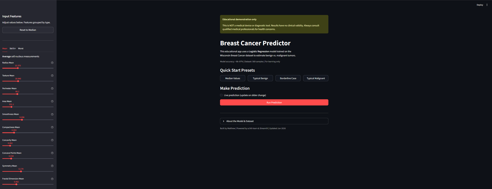
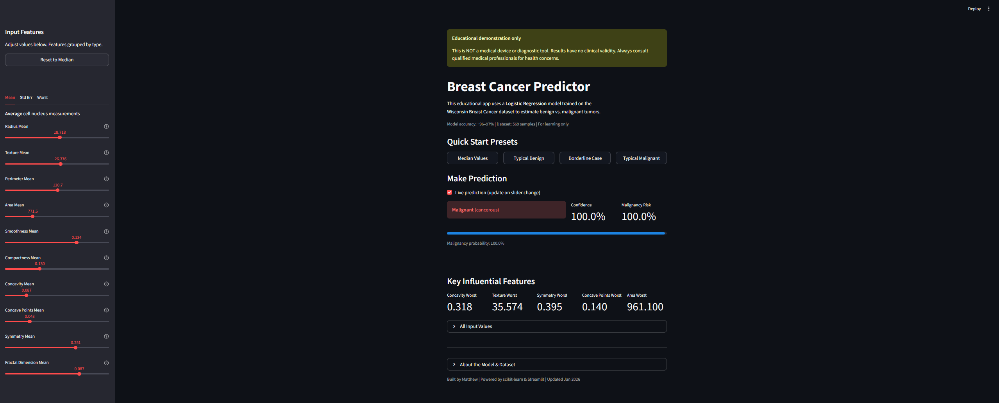
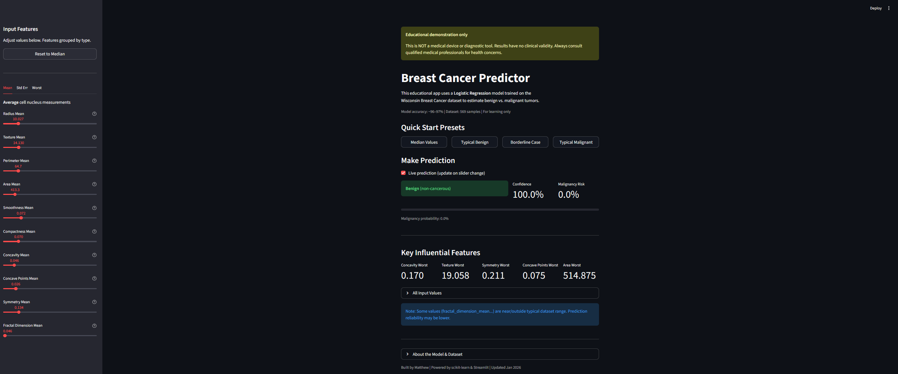
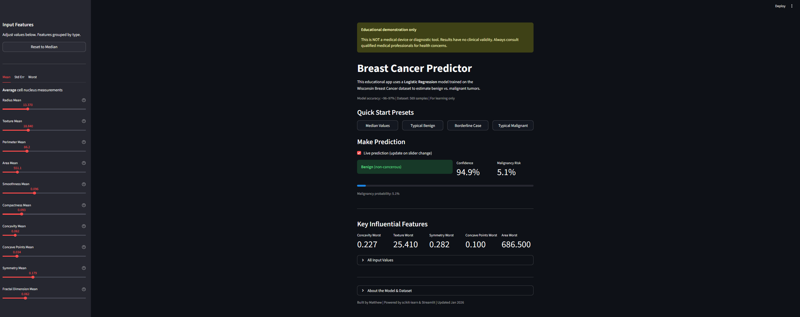

<!-- ---
title: Breast Cancer Predictor
colorFrom: pink
colorTo: purple
sdk: docker
pinned: true
license: mit
short_description: Educational breast cancer prediction demonstration

--- -->

## Project Description

This is an interactive web application built with Streamlit that allows users to input cell nuclei measurements and obtain a prediction of whether a breast tumor is classified as benign or malignant.

- **Model**: Logistic Regression (chosen for optimal balance between performance and interpretability)  
- **Dataset**: UCI Breast Cancer Wisconsin (Diagnostic) – 569 samples, 30 features  
- **Performance**: Approximately 96–97% accuracy on hold-out test set (5-fold cross-validation mean: 97.1%)  
- **Most predictive features**: concavity_worst, texture_worst, symmetry_worst, concave points_worst  

**Important Notice**  
This application is strictly an educational demonstration. It is not a medical diagnostic tool and must not be used to make real medical decisions. Model predictions should never replace professional clinical evaluation. Always consult a qualified healthcare professional for diagnosis and treatment.

The complete training pipeline, exploratory data analysis, model comparison, and feature importance analysis are available in the main repository:  
🔗 **[[Link to main GitHub repo](https://github.com/mN5-07/breast-cancer-diagnostic-app)]**

## How to Use the Application

1. Adjust the input sliders in the sidebar (organized into Mean, Standard Error, and Worst measurement categories)  
2. Use the Quick Start buttons to load representative cases:  
   - Dataset Median Values  
   - Typical Benign Example  
   - Borderline Case  
   - Typical Malignant Example  
3. Click "Predict Tumor Type"  
4. Review:  
   - Predicted class (Benign / Malignant)  
   - Estimated malignancy probability  
   - Confidence indicator  
   - Highlighted values of the most influential features  

## Key Findings – Most Predictive Features

Permutation importance results (Logistic Regression, test set):

| Rank | Feature                | Mean Importance | Interpretation                                      |
|------|------------------------|------------------|-----------------------------------------------------|
| 1    | concavity_worst        | 0.025           | Severity of deepest concavities (strongest predictor) |
| 2    | texture_worst          | 0.023           | Extreme variation in gray-scale values              |
| 3    | symmetry_worst         | 0.020           | Extreme asymmetry                                   |
| 4    | concave points_worst   | 0.012           | Number of concave portions in extreme measurements  |
| 5    | concave points_mean    | 0.005           | Average number of concave portions                  |

**Observation**: Features derived from the "worst" (most extreme) values consistently show higher predictive power than mean or standard error measurements. This is consistent with pathological understanding that malignant tumors tend to exhibit more irregular and aggressive morphological characteristics.

## Screenshots

### Main Interface with Input Controls

  

### Example – Typical Malignant Prediction

  

### Example – Typical Benign Prediction

  

### Example – Median Dataset Values

  

## Technology Stack

- **Frontend / Application Framework**: Streamlit  
- **Machine Learning**: scikit-learn (Logistic Regression + StandardScaler)  
- **Deployment**: Streamlit Community Cloud  
- **Development & Analysis**: Jupyter notebooks (EDA, preprocessing, model comparison, feature importance)

## Ethical and Responsible Use

- The model was trained on a limited public dataset (n=569)  
- No clinical validation has been performed  
- Output consists of probabilistic estimates only  
- These predictions are not substitutes for biopsy, medical imaging, or expert clinical diagnosis  
- Professional medical evaluation must always take precedence

## Deployment Notes

The application is currently hosted via Streamlit Community Cloud.  
For production-grade or scalable deployment, the application can be containerized (Docker) and hosted on platforms such as Hugging Face Spaces, Fly.io, Render, or AWS ECS.